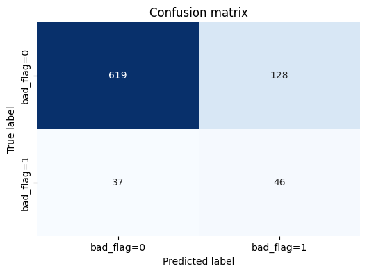
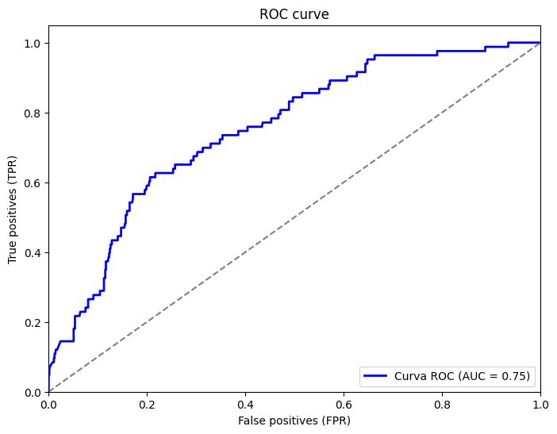
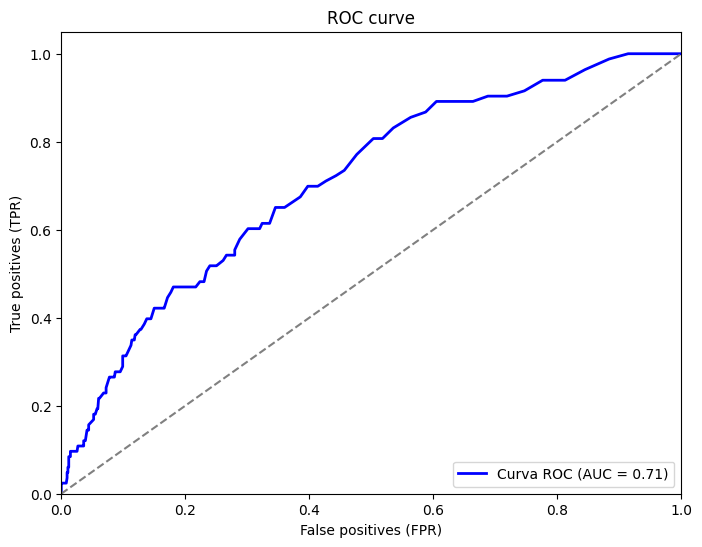

# Concesión de Préstamos

Este es un proyecto de análisis de datos centrado en el proceso de concesión de préstamos, que forma parte de una prueba técnica de la empresa Mokka. El objetivo principal es desarrollar un modelo que prediga el valor de la variable objetivo **bad_flag**, o la concesion del préstamo.

## Introducción

El proyecto se divide en los siguientes notebooks principales: 

- **EDA**: Se realiza un analisis exploratorio de los datos para hacernos una idea general de cómo se distribuye la variable bad_flag con respecto al resto de variables (género, mes en el que se solicita el préstamo o región)

- **Main**: El notebook Main realiza una primera aproximación de diferentes modelos a usar, entre ellos BaggingClassifier, GaussianNB, RandomForestClassifier, o ExtraTreesClassifier. Los resultados de las metricas utilizadas (Accuracy, precision, recall y f1) muestran un resultado insatisfactorio debido al desbalanceamiento de clases, por lo que se tomarán dos posibles aproximaciones, realizadas en los notebook exp_1 y exp_2, utilizando las tecnicas de undersampling (con RandomUnderSampling) y oversampling (SMOTE).

- **Exp_1**: Este notebook usa el método de undersampling (para balancear las clases de la variable target bad_flag), entrena de nuevo los modelos KNeighborsClassifier, LogisticRegression, BaggingClassifier, GaussianNB, RandomForestClassifier, ExtraTreesClassifier y se utilizan las metricas citadas anteriormente.

- **Exp_2**: Este notebook usa el método de oversampling usando la técnica SMOTE (Synthetic Minority Over- Sampling), entrena de nuevo los modelos KNeighborsClassifier, LogisticRegression, BaggingClassifier, GaussianNB, RandomForestClassifier, ExtraTreesClassifier y se utilizan las metricas citadas anteriormente.

Se dividirá la estructuctura en dos partes diferenciadas, por un lado la primera parte, correspondera al EDA (Exploratory Data Analysis) y la segunda parte corresponderá a los notebooks Main, exp_1 y exp_2, donde se prueban diferentes modelos de clasificación.

## Parte 1: Análisis Exploratorio de Datos (EDA)

Con el análisis exploratorio de datos se han comprobado las distintas relaciones entre la concesión o no del préstamo, con diferentes características del solicitante, es decir, su género, la región de la que proviene, o qué mes pidió el préstamo. las siguientes gráficas ilustra lo anterior:


Como se puede comprobar, octubre es el mes donde mas préstamos se solicitan.

En cuanto al género y la region del solicitante nos encontramos lo siguiente:


Hay una disparidad muy grande entre hombres y mujeres en cuanto a solicitud de préstamos sin embargo, el porcentaje de aceptados es mayor para las mujeres, un **14%** por un **9.35%** de los hombres. En cuanto a las regiones, las tres regiones que más prestamos solicitan son la región 3, 6 y 2, mientras que en porcentaje de aceptación, las tres primeras son la **region 4** con un **12.4%**, la **region 3** con un **11.4%**, y la **region 0** con un **10.5%**.


## Parte 2: Machine learning

En esta segunda parte se utiliza el dataset modificado obtenido desde el notebook EDA.ipynb "clean_dataset.csv" para probar diferentes algoritmos de clasificación. El primer notebook corresponde a Main.ipynb donde se prueban los algoritmos BaggingClassifier, GaussianNB, RandomForestClassifier y ExtraTreesClassifier, se grafican las matrices de confusion para cada uno de los algoritmos y se obtienen las siguientes métricas para cada uno de ellos: 

| Algoritmo             | F1-Score  | Accuracy  | Precisión | Recall    |
|-----------------------|-----------|-----------|-----------|-----------|
| BaggingClassifier     | 0.2095     | 0.90      | 0.5      |0.1325      |
| GaussianNB            | 0.1929      | 0.8891      | 0.3548      | 0.1325      |
| RandomForestClassifier| 0.1836      | 0.9036      | 0.6      | 0.1084      |
| ExtraTreesClassifier  | 0.1020      | 0.8939      | 0.3333      | 0.0602      |

Como se puede comprobar, las métricas reflejan un claro desbalanceamiento de clases, ya que aunque la métrica accuracy es muy alta para todas los algoritmos, el recall y la precisión son muy bajas, esto quiere decir que nuestro modelo no es capaz de clasificar correctamente los casos donde bad_flag es 1, ya que recall (cantidad de casos que nuestro modelo es capaz de predecir correctamente) y precision (si lo que predice nuestro modelo es correcto) tienen unos valores bajos. A modo de ejemplo, la siguiente matriz de confusión (Del RandomForestClassifier) muestra el número de muestras predichas:

<p align="center">
  
</p>

Donde se ve que aunque la precision sea de 0.6, es debido a que el número de muestras que se clasifican como 1 correctamente (nueve) y el número de muestras incorrectamente predichas como 1 (seis) son muy pocas. Por tanto, lo siguiente que se va a hacer es aplicar submuestreo y sobremuestreo para balancear la variable **bad_flag**.

### 2.1) Undersample con RandomUnderSampler

Este proceso se realiza en el notebook **Exp_1 Undersampling** y los pasos a realizar son los siguientes:
- Se divide el dataset original en las muestras train y test.
- Se aplica RandomUnderSampler de la libreria imblearn sólo a la parte de entrenamiento, para evaluar el modelo correctamente.
- Se vuelven a entrenar los modelos anteriores y además de utilizan tambien KNeighborsClassifier y LogisticRegression.
- Viendo los resultados, se ha elegido RandomForest para realizar una prueba un poco mas exhaustiva y probar diferentes hiperparámetros. Para ello se utiliza la libreria **optuna** que nos permite probar diferentes combinaciones para obtener un mejor rendimiento. En este caso, la métrica utilizada para evaluar dicho rendimiento, es el F1-score.

Los resultados obtenidos son los siguientes, para el modelo RandomForest, aplicando los hiperparámetros por defecto:  

<p align="center">
  
</p>


| Algoritmo             | F1-Score  | Accuracy  | Precisión | Recall    |
|-----------------------|-----------|-----------|-----------|-----------|
| RandomForestClassifier| 0.3052      | 0.6819      | 0.1952      | 0.6987      |

Utilizando optuna, se observa que los mejores hiperparametros son 'n_estimators': 164 y 'max_depth': 4. El modelo obtiene asi los siguientes resultados:

<p align="center">
  
</p>

| Algoritmo             | F1-Score  | Accuracy  | Precisión | Recall    |
|-----------------------|-----------|-----------|-----------|-----------|
| RandomForestClassifier| 0.3243      | 0.6987      | 0.2090      | 0.7228      |

Se observa una pequeña mejora en los resultados, pero es casi imperceptible. Por último, la curva ROC queda como sigue: 

<p align="center">
  
</p>

De los resultados anteriores se puede concluir que al aplicar undersampling el modelo etiqueta muchas muestras como 1, por lo que esta perdiendo mucha información sobre el resto de muestras. El siguiente experimento utilizará la técnica de oversampling para aumentar sintéticamente las muestras de la clase minoritaria.

### 2.2) Oversample con SMOTE

El notebook **Exp_2 SMOTE** se divide en las siguientes partes:
- Se divide el dataset original en las muestras train y test.
- En este notebook se utilizara SMOTE de dos formas. La primera sin Cross-Validation, y la segunda utilizandolo.

Sin cross-validation:
- Se aplica SMOTE directamente a la parte de train para que test no se vea afectado y se evalue el modelo correctamente.
- Se entrenan los modelos anteriores.
- Se plotea la matriz de confusión junto con las métricas obtenidas para cada modelo.
- Se ha elegido el algoritmo RandomForest para aplicar optuna y probar diferentes hiperparámetros

Con cross-validation:
- Para aplicar correctamente cross-validation y smote, hay que aislar cada muestra y entonces aplicar SMOTE: 

```python
rand_for_sm=RandomForestClassifier()

rand_for_params = {
    'n_estimators': [50, 100, 150, 200], 
    'max_depth': [10, 20, 30],  
}
rand_rand_for = RandomizedSearchCV(RandomForestClassifier(), rand_for_params, n_iter=4)

sss = StratifiedKFold(n_splits=5, random_state=None, shuffle=False)

for train, test in sss.split(X_train, y_train):
    pipeline = make_pipeline(SMOTE(sampling_strategy='minority'), rand_rand_for) # SMOTE happens during Cross Validation not before..
    model = pipeline.fit(X_train.iloc[train], y_train.iloc[train])
    best_est = rand_rand_for.best_estimator_
    prediction = best_est.predict(X_train.iloc[test])
```
- Finalmente se aplica el modelo final al test.

Los resultados obtenidos han sido los siguientes, sin cross-validation:

<p align="center">
  
</p>

| Algoritmo             | F1-Score  | Accuracy  | Precisión | Recall    |
|-----------------------|-----------|-----------|-----------|-----------|
| RandomForestClassifier| 0.3579      | 0.8012      | 0.2643      | 0.5542      |


<p align="center">
  
</p>

De los resultados sin cross validation (usando el conjunto completo de train para aplicar SMOTE) se puede observar que el modelo sigue clasificando incorrectamente muestras como 1, aunque ha obtenido mejores resultados que con el undersampling.

<p align="center">
  
</p>

| Algoritmo             | F1-Score  | Accuracy  | Precisión | Recall    |
|-----------------------|-----------|-----------|-----------|-----------|
| RandomForestClassifier| 0.2699      | 0.8566      | 0.275      | 0.2650      |


<p align="center">
  
</p>

Usando cross-validation se clasifican menos muestras como 1 erroneamente, pero tambien está lejos de tener un buen comportamiento, ya que tanto la precision como el recall tienen valores muy bajos, clasificando muchos valores erroneamente como 1 cuando no lo son, y clasificando como 0 cuando deberia ser al contrario. 
En este caso, depende de si se permite cometer errores a la hora de clasificar como 1 (es decir, tenemos flexibilidad para tener una baja precision) podría valer este modelo, o se debería intentar mejorar las métricas obtenidas ya sea probando nuevos modelos, o mejorando los datos de entrada.


